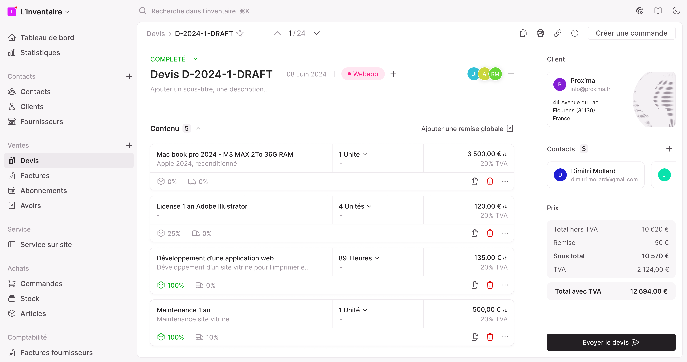

# 📒 linventaire.app

> *The ERP co-pilot for your business — Agile. Flexible. Fast.*




---

## ✨ Features

✅ Invoice & Quote management  
✅ Recurring invoices  
✅ Supplier orders and invoices  
✅ CRM and contact management  
✅ Inventory tracking  
✅ User‑friendly web interface
✅ Deployable with Docker
✅ Powerful and simple stack (Node+Postgres)
✅ Open‑source

---

## 🧰 Project Structure

- **frontend/**  
  Vue 3 + Vite + TypeScript web application  
  ([frontend/README.md](frontend/README.md))

- **backend/**  
  Node.js + TypeScript + Fastify + Prisma backend  
  ([backend/README.md](backend/README.md))

- **.github/workflows/**  
  GitHub Actions for CI/CD deployment  
  ([.github/workflows/deploy-docker.yml](.github/workflows/deploy-docker.yml))

---

## 🚀 Quick Start (with Docker Compose)

You can launch the full application (frontend + backend + database) using Docker Compose for development and testing.

### Prerequisites

- [Docker](https://www.docker.com/get-started) installed
- [Docker Compose](https://docs.docker.com/compose/) installed

### Run

```bash
git clone https://github.com/L-Inventaire/linventaire.app.git
cd linventaire.app
docker-compose up --build
```